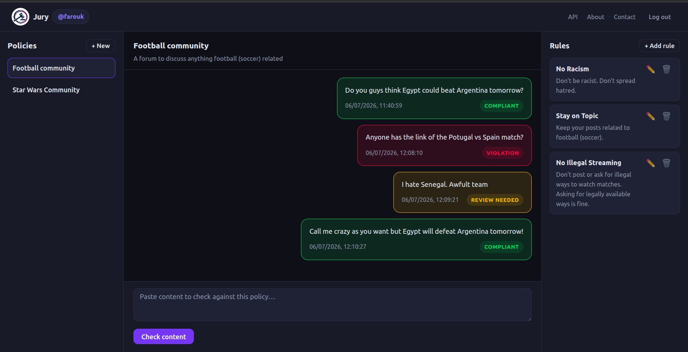
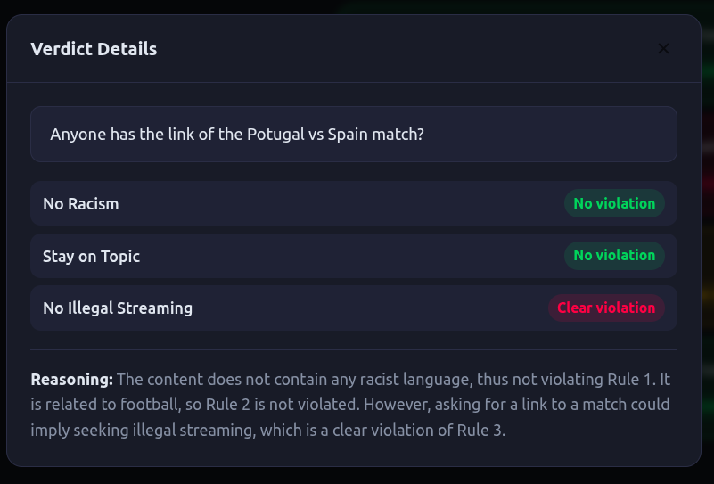
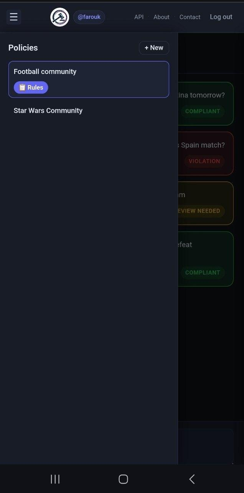
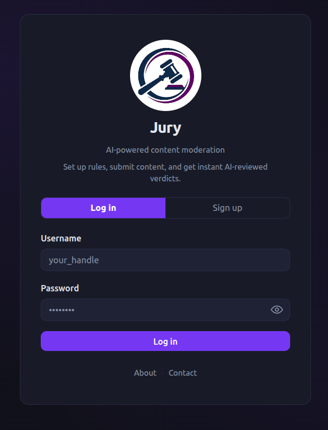
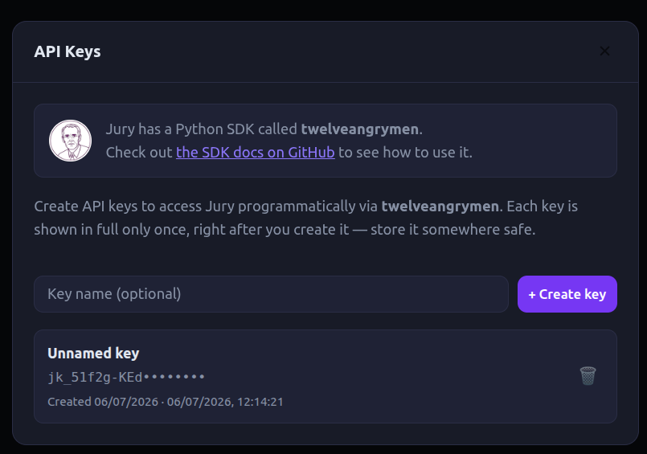

# ⚖️ Jury — Frontend

**AI-powered content moderation, from the browser.** A vanilla JavaScript single-page app — no React, no Vue, no build step — that gives teams a clean, real-time interface for defining moderation policies, submitting content, and reading structured, per-rule AI verdicts at a glance.

🔗 **Live app:** [jury-livid.vercel.app](https://jury-livid.vercel.app)
🔗 **Backend & SDK:** see the root of this monorepo



---

## About the frontend

This isn't a scaffolded-out CRUD app. It's a deliberately **framework-free** SPA — built with plain ES modules, the native DOM API, and CSS custom properties — that still delivers the UX you'd expect from a modern React app: live polling, optimistic UI updates, mobile drawer navigation, modals, and inline validation. It's a demonstration of strong JavaScript fundamentals and disciplined architecture over reaching for a framework by default.

A few things worth a closer look if you're reviewing this code:

- **Zero build step.** Open `index.html`, and the whole app runs. No webpack, no bundler, no `node_modules` for the frontend at all — just native ES module imports resolved directly by the browser.
- **A real component model, without a framework.** Each "component" (`AuthPage`, `Dashboard`, `PoliciesSidebar`, `RulesPanel`, `ContentFeed`) is a plain function that owns a DOM subtree, renders it, and wires up its own event listeners — a lightweight pattern that scales surprisingly well for an app this size.
- **Live status without a socket.** Pending AI verdicts are polled on an interval and patched into the DOM in place (no full re-render), with a failure-counting backoff so a flaky network doesn't spin forever or fail silently.
- **Security-conscious API key UX.** Generated API keys are shown exactly once, in a clearly-marked "copy me now" box, with a one-click clipboard action — mirroring how GitHub/Stripe-style dashboards handle secrets.
- **Thoughtful mobile design.** The two side panels (Policies, Rules) become slide-in drawers on small screens, each triggered contextually rather than bolted on as an afterthought.

---

## What is Jury?

Jury lets you define **policies** — named containers for content guidelines — made up of individual, plain-language **rules** ("no hate speech," "no promotional spam," etc.). Submit any piece of text, and an LLM checks it against every rule in the policy, returning a per-rule score:

| Score | Meaning              |
|-------|----------------------|
| `0`   | No violation         |
| `1`   | Possible violation   |
| `2`   | Clear violation       |

Those scores roll up into a single at-a-glance verdict color:

- 🟢 **Green** — every rule scored `0`
- 🟡 **Yellow** — at least one rule scored `1`, none scored `2`
- 🔴 **Red** — at least one rule scored `2`



---

## Features

- 🔐 **Auth** — signup/login with live password-match feedback, show/hide password toggles, and inline error handling for both simple and structured (Pydantic-style) validation errors
- 📋 **Policies & Rules** — full CRUD for policies and their rules, with unsaved-rule guards before content checks are allowed
- 💬 **Content feed** — chat-like feed of submissions with live-polling verdict updates and a dedicated error state for moderation failures
- 🎨 **Color-coded verdicts** — every verdict is reduced to a single traffic-light color, with full detail available on click
- 🔑 **API key management** — create, list, and revoke keys for programmatic access, with secrets shown exactly once
- 📱 **Fully responsive** — slide-in drawer navigation for Policies and Rules panels on mobile, with a shared backdrop and single-drawer-at-a-time behavior
- ℹ️ **About / Contact / API info modals** — shared across the logged-out and logged-in experience



---

## Tech stack

| Layer          | Choice                                                        |
|----------------|----------------------------------------------------------------|
| Language       | Vanilla JavaScript (ES2020+, native ES modules)                |
| Styling        | Plain CSS with custom properties (design tokens) — no preprocessor |
| Markup         | Semantic HTML, generated via template literals                 |
| State          | Local closures per component — no global store                |
| HTTP           | Native `fetch`                                                  |
| Hosting        | [Vercel](https://vercel.com) (static hosting + SPA rewrites)    |
| Local dev      | `python3 -m http.server` — no dev server dependency at all      |

No framework, no bundler, no transpiler — the code that runs in your browser is exactly the code in this repo.

---

## Project structure

```
frontend/
├── index.html                 # Entry point — loads config.js, then app.js
├── config.js                  # Sets window.JURY_API_URL (swap for local/prod)
├── app.js                      # Boots the app: routes between AuthPage / Dashboard
├── vercel.json                 # SPA rewrite rule (all routes → index.html)
├── assets/
│   ├── logo.jpg                 # Jury logo
│   └── sdk_logo.jpg             # twelveangrymen SDK logo
├── styles/
│   └── main.css                 # Design tokens (CSS vars) + all component styles
├── services/
│   └── api.js                   # Single fetch wrapper — auth, policies, rules,
│                                 # content, API keys; centralized error parsing
├── utils/
│   └── verdict.js                # Pure functions: verdict → color, level → label
├── pages/
│   └── Dashboard.js              # Top-level authenticated shell (topbar + panels)
└── components/
    ├── auth/
    │   └── AuthPage.js            # Login / signup, password UX
    ├── policies/
    │   ├── PoliciesSidebar.js      # Policy list, create, delete
    │   └── RulesPanel.js           # Rule list, create, edit, delete
    ├── content/
    │   └── ContentFeed.js          # Content submission + live verdict polling
    └── shared/
        └── InfoModals.js           # About / Contact / API-key management modals
```

---

## Getting started

```bash
git clone <this-repo>
cd frontend
python3 -m http.server 5500
```

Then open **http://localhost:5500**.

### Pointing at a backend

Edit `config.js`:

```js
// Local backend
window.JURY_API_URL = "http://localhost:8000";

// Deployed backend (default)
window.JURY_API_URL = "https://mfarouk-jury-backend.hf.space/api";
```

Everything else — auth, policies, rules, content, API keys — reads from `window.JURY_API_URL`, so switching environments is a one-line change.

---

## Deployment

Deployed as a static site on Vercel. `vercel.json` contains a single rewrite so any path falls back to `index.html`, letting the app handle its own (client-side) routing:

```json
{ "rewrites": [{ "source": "/(.*)", "destination": "/index.html" }] }
```

Cache-busting for the module entry point is handled with a version query string in `index.html` (`app.js?v=3`) — bump it on deploy if you need to force a refresh past a stale service worker or aggressive CDN cache.



---

## API key management

Logged-in users can generate scoped API keys for programmatic access (paired with the [`twelveangrymen`](https://github.com/MohamedFarouk94/jury/tree/master/sdk) Python SDK) directly from the **API** tab: create a named key, copy the secret shown once at creation, and revoke keys that are no longer needed — all without leaving the dashboard.



---

## Design system

All visual styling flows from a small set of CSS custom properties defined once in `styles/main.css`:

```css
:root {
  --bg: #0f1117;
  --surface: #181c27;
  --accent: #6366f1;
  --green: #22c55e;
  --yellow: #eab308;
  --red: #ef4444;
  --radius: 8px;
  --font: 'Inter', system-ui, sans-serif;
}
```

Every button, badge, modal, and panel derives from these tokens, which keeps the dark, focused aesthetic consistent across every screen without a design system library.

---
